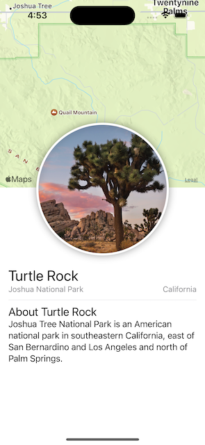

#  Swift UI Essentials

Project to learn about Swift UI following the [tutorial](https://developer.apple.com/tutorials/swiftui/creating-and-combining-views)

## Creating and Combining views

What I learned:

### DAY 1

- Create a new project and get familiar with the canvas
- Combine views using Stacks
- Create a custom Image view
- Use SwiftUI views, MapKit, from other frameworks
- Compose the detail view by using the CircleImage, the text stack, and the map view

